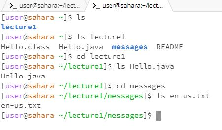
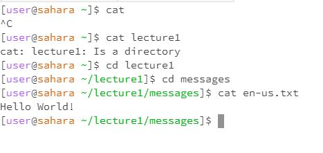

**Lab Report 1**

  When running cd initially it was initially in the home directory, /home. 
  When you do not input any arguments nothing happens as cd is how you move through directories. If you don't specify a place to go to, it will simply go nowhere, here the working directory remains unchanged. There was no error.
  When I specified cd into a specific directory from my /home direcotry I went to lecture1 with "cd lecture1" the working directory became /home/lecture1. This is because now that I used cd into a specific directory it now entered that directory. There was no error.
  Lastly I first used cd to go into messages to try and run cd on a .txt file. At this point my working directory was /home/lecture1/messages. When I tried to cd one of the text files it says that it was not a directory. This would result in an error and this is because cd is used to change your working directory into another direcotry not a file. It cannot input a file as it is not a directory.

  Starting with a new terminal I went to test the ls commands. At first my working directory just the home direcotry /home. 
  When I ran ls with no arguments it listed the only visible directory which was lecture1. This makes sense as in the home directory that only visable directory would simply be lecture1 which has the code and other directories we work with. ls with no arguments just lists out what is visable in the working directory. We can see it as the main directory on the side of our files on EdStem as well. This is not an error.
  When I inputted with my working directory still being in the home directory /home ls lecture1 is then displayed the files and directories that were in lecture1. It effectively just revealed the contents of this directory. This is becasue when you run ls with a directory specified it can access and display the contents inside. This is not an error.
  Lastly, I changed my working directory to /home/lecture1/messages and tried to ls one of the text files. When I tried the result was simply the name of the file. This is because ls as a command was made to display the contents of directories and since you are now specifying a file there are no "contents" in it to display. This is not an error. As a side note you can get the same results if you type in ls lecture1/messages/whatever txt file in which it would just return "lecture1/messages/whatever txt file".

  Starting with a new terminal I went to test the cat commands. At the start my working directory was once again reset to just the home directory /home.
  From the working directory /home when I ran cat with no arguments nothing happened. This is because when you cat something it looks for something to print and when you give an empty argument it has nothing to print. It waits for an input which here I just control c'd in order to terminate this wait for an input. This is not an error.
  From the working directory /home when I tried to cat a specific directory which in this case i did lecture1 it returned whether or not lecture1 was a directory or not. This is because since it isn't a file and can't produce print the inside contents EdStem's default is to just return that you used cat on a directory in a small little message "lecture1: Is a directory". This is not an error.
  I then changed my working directory to /home/lecture1/messages and then ran cat on one of the text files. This printed out what was in the text file. In this case I did it on the english file which printed out "Hello World!". This makes sense as the purpose of cat is to display the contents of a file and here it dispalys what was inside "en-us.txt". This is not an error.
  
